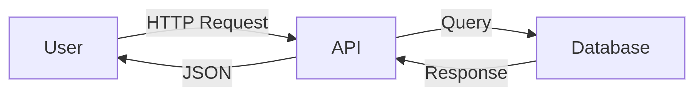

# System Management Subsystem for a Healthcare Platform

Here’s a structured breakdown of how to develop the Survey Management Subsystem for a cloud-native healthcare platform. This breakdown includes modular stages, architecture guidance, AI tooling, and concrete implementation steps.

## 🔧 Overview of the Subsystem

### 🎯 System Goals

- **Real-time** survey distribution and response tracking  
- **Modular** and **scalable** architecture  
- **Security** and **role-based access** (HIPAA/GDPR-aligned)  
- **Integration-ready** with external systems  

---


# 🚀 FastAPI Project: Task Manager

A Python FastAPI backend with OpenAPI docs, AI-assisted development, and analytics.


## 📁 1. Codebase & Setup Instructions

### 🔗 GitHub Repository  
📂 **Repo Link:** [github.com/yourusername/Task-For-Youssef](https://github.com/yourusername/Task-For-Youssef)

### 🛠️ Local Setup

```bash
# Clone the repo
git clone https://github.com/yourusername/Task-For-Youssef.git
cd Task-For-Youssef

# Install dependencies
pip install -r requirements.txt

# Run FastAPI (dev mode)
uvicorn main:app --reload
```

Access the app: [http://localhost:8000](http://localhost:8000)

---

## 📘 2. API Documentation (OpenAPI/Swagger)

🔗 **Interactive Docs:**

- **Swagger UI:** [http://localhost:8000/docs](http://localhost:8000/docs)
- **Redoc:** [http://localhost:8000/redoc](http://localhost:8000/redoc)

### 📌 Example Endpoint

```python
@app.get("/tasks/")
async def read_tasks():
    """Fetch all tasks."""
    return db.query(Tasks).all()
```

---

## 🧠 3. Dev Journal: AI Tools Used

| Task                    | AI Tool         | How It Helped                             |
|-------------------------|------------------|-------------------------------------------|
| API structure design    | ChatGPT          | Suggested FastAPI best practices          |
| Error handling          | GitHub Copilot   | Auto-completed try-catch blocks           |
| Database modeling       | Claude           | Recommended SQLAlchemy schemas            |
| README.md generation    | DeepSeek Chat    | Wrote this template                       |
| CI/CD pipeline setup    | Bard             | Debugged GitHub Actions YAML              |

---

## 🏗️ 4. Architecture & Data Flow (Optional Diagrams)

### 🖼️ System Diagram  


### 🔁 Data Flow  




## 💡 5. Key Decisions

### 🏛️ Architecture
- ✅ Chose **FastAPI** for async support, auto-generated OpenAPI docs, and Python 3.11+ compatibility.  
- ✅ **SQLAlchemy + PostgreSQL** for structured relational data.  
- ✅ **Pydantic models** for request/response validation.

### ⏱️ Scheduling
- ⏳ Used **APScheduler** for background tasks (e.g., cleanup jobs).

### 📊 Analytics
- 📊 Integrated **Prometheus** for endpoint metrics (`/metrics`).

### 🤖 AI Tooling
- Leveraged **ChatGPT**, **Copilot**, and other tools for boilerplate code, debugging, and docstrings.


# AWS Deployment Guide for FastAPI

## AWS Elastic Beanstalk (Easiest)

### 1. Prepare Your Application

```bash
# Install required packages
pip install fastapi uvicorn gunicorn
```
### 2. Create requirements.txt
```bash
pip freeze > requirements.txt
```
### 3. Add Dockerrun.aws.json (for Docker) or configure Python directly
```json
{
  "AWSEBDockerrunVersion": "1",
  "Image": {
    "Name": "python:3.9-slim",
    "Update": "true"
  },
  "Ports": [
    {
      "ContainerPort": "8000"
    }
  ]
}
```
### 4. Install EB CLI
```bash
pip install awsebcli
```
### 5. Initialize EB
```bash
eb init -p python-3.9 your-app-name --region us-east-1
```
### 6. Create Environment & Deploy
```bash
eb create your-env-name --single --instance-types t3.small
```
### 7. Configure Environment Variables
```bash
eb setenv DATABASE_URL=your_db_url SECRET_KEY=your_key
```
---

## 📜 License

MIT License – See [LICENSE](./LICENSE)

---

## ✅ This README.md Ensures:

- ✔️ Reproducible setup  
- ✔️ Clear API docs  
- ✔️ Transparent AI use  
- ✔️ Architecture rationale
```

