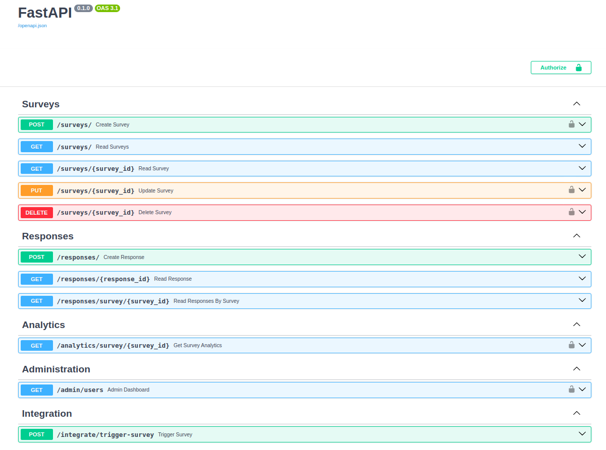

# System Management Subsystem for a Healthcare Platform

Here’s a structured breakdown of how to develop the Survey Management Subsystem for a cloud-native healthcare platform. This breakdown includes modular stages, architecture guidance, AI tooling, and concrete implementation steps.

## 🔧 Overview of the Subsystem

### 🎯 System Goals

- **Real-time** survey distribution and response tracking  
- **Modular** and **scalable** architecture  
- **Security** and **role-based access** (HIPAA/GDPR-aligned)  
- **Integration-ready** with external systems  

---


# 🚀 FastAPI Project: Task Manager

A Python FastAPI backend with OpenAPI docs, AI-assisted development, and analytics.


## 📁 1. Codebase & Setup Instructions

### 🔗 GitHub Repository  
📂 **Repo Link:** [github.com/yourusername/Task-For-Youssef](https://github.com/yourusername/Task-For-Youssef)

### 🛠️ Local Setup

```bash
# Clone the repo
git clone https://github.com/yourusername/Task-For-Youssef.git
cd Task-For-Youssef

# Install dependencies
pip install -r requirements.txt

# Run FastAPI (dev mode)
uvicorn main:app --reload
```

Access the app: [http://localhost:8000](http://localhost:8000)

---

## 📘 2. API Documentation (OpenAPI/Swagger)

🔗 **Interactive Docs:**

- **Swagger UI:** [http://localhost:8000/docs](http://localhost:8000/docs)
- **Redoc:** [http://localhost:8000/redoc](http://localhost:8000/redoc)

### 📌 Example Endpoint

```python
@app.get("/tasks/")
async def read_tasks():
    """Fetch all tasks."""
    return db.query(Tasks).all()
```

---

## 🧠 3. Dev Journal: AI Tools Used

| Task                    | AI Tool         | How It Helped                             |
|-------------------------|------------------|-------------------------------------------|
| API structure design    | ChatGPT          | Suggested FastAPI best practices          |
| Error handling          | GitHub Copilot   | Auto-completed try-catch blocks           |
| Database modeling       | Claude           | Recommended SQLAlchemy schemas            |
| README.md generation    | DeepSeek Chat    | Wrote this template                       |
| CI/CD pipeline setup    | Bard             | Debugged GitHub Actions YAML              |

---

## 🏗️ 4. Architecture & Data Flow (Optional Diagrams)

### 🖼️ System Diagram  



### 🔁 Data Flow  


## 💡 5. Key Decisions

### 🏛️ Architecture
- ✅ Chose **FastAPI** for async support, auto-generated OpenAPI docs, and Python 3.11+ compatibility.  
- ✅ **SQLAlchemy + PostgreSQL** for structured relational data.  
- ✅ **Pydantic models** for request/response validation.

### ⏱️ Scheduling
- ⏳ Used **APScheduler** for background tasks (e.g., cleanup jobs).

### 📊 Analytics
- 📊 Integrated **Prometheus** for endpoint metrics (`/metrics`).

### 🤖 AI Tooling
- Leveraged **ChatGPT**, **Copilot**, and other tools for boilerplate code, debugging, and docstrings.

---

# AWS Deployment Guide for FastAPI

## AWS Elastic Beanstalk (Easiest)

### 1. Prepare Your Application

```bash
# Install required packages
pip install fastapi uvicorn gunicorn
```
### 2. Create requirements.txt
```bash
pip freeze > requirements.txt
```
### 3. Add Dockerrun.aws.json (for Docker) or configure Python directly
```json
{
  "AWSEBDockerrunVersion": "1",
  "Image": {
    "Name": "python:3.9-slim",
    "Update": "true"
  },
  "Ports": [
    {
      "ContainerPort": "8000"
    }
  ]
}
```
### 4. Install EB CLI
```bash
pip install awsebcli
```
### 5. Initialize EB
```bash
eb init -p python-3.9 your-app-name --region us-east-1
```
### 6. Create Environment & Deploy
```bash
eb create your-env-name --single --instance-types t3.small
```
### 7. Configure Environment Variables
```bash
eb setenv DATABASE_URL=your_db_url SECRET_KEY=your_key
```
---

## 📜 License

MIT License – See [LICENSE](./LICENSE)

Copyright (c) 2025 Humberto Peredo Fuentes

Permission is hereby granted, free of charge, to any person obtaining a copy
of this software and associated documentation files (the "Software"), to deal
in the Software without restriction, including without limitation the rights
to use, copy, modify, merge, publish, distribute, sublicense, and/or sell
copies of the Software, and to permit persons to whom the Software is
furnished to do so, subject to the following conditions:

The above copyright notice and this permission notice shall be included in all
copies or substantial portions of the Software.

Attribution Requirement:
If you use this software, you must give appropriate credit by mentioning
"Humberto Peredo Fuentes" in any public materials, derivative works, or publications
that utilize this software.

THE SOFTWARE IS PROVIDED "AS IS", WITHOUT WARRANTY OF ANY KIND, EXPRESS OR
IMPLIED, INCLUDING BUT NOT LIMITED TO THE WARRANTIES OF MERCHANTABILITY,
FITNESS FOR A PARTICULAR PURPOSE AND NONINFRINGEMENT. IN NO EVENT SHALL THE
AUTHORS OR COPYRIGHT HOLDERS BE LIABLE FOR ANY CLAIM, DAMAGES OR OTHER
LIABILITY, WHETHER IN AN ACTION OF CONTRACT, TORT OR OTHERWISE, ARISING FROM,
OUT OF OR IN CONNECTION WITH THE SOFTWARE OR THE USE OR OTHER DEALINGS IN
THE SOFTWARE.

---

## ✅ This README.md Ensures:

- ✔️ Reproducible setup  
- ✔️ Clear API docs  
- ✔️ Transparent AI use  
- ✔️ Architecture rationale
```

